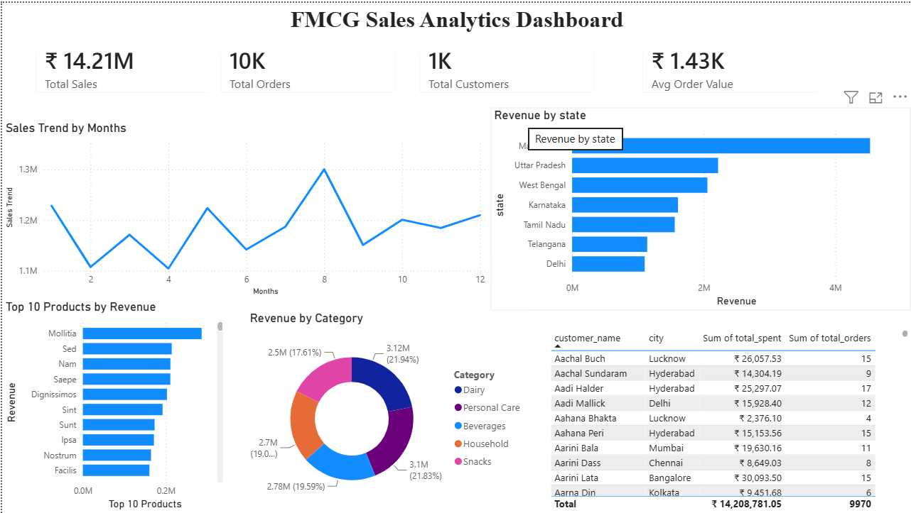

# 🏪 Enterprise FMCG Sales Analytics Pipeline using Databricks

## 📌 Project Overview

After acquiring another FMCG company, the organization faced challenges due to different data systems and formats, leading to data inconsistency and the absence of a unified reporting system. This affected business reporting, KPI tracking, and decision-making.

To solve this problem, an end-to-end Data Engineering pipeline was built using Databricks Medallion Architecture (Bronze, Silver, Gold). Raw data from multiple sources was ingested, cleaned, transformed into business-ready datasets, and visualized through Power BI dashboards.

---

# 🎯 Business Problem

- Multiple disconnected data sources
- Different data formats
- Duplicate and inconsistent records
- Missing values
- No centralized reporting
- Slow business decision-making

---

# 💡 Solution

Designed and implemented a scalable Medallion Architecture using Databricks.

```
                CSV Files
                    │
                    ▼
          Bronze Layer (Raw Data)
                    │
                    ▼
      Silver Layer (Cleaned Data)
                    │
                    ▼
     Gold Layer (Business Ready Data)
                    │
                    ▼
         Databricks SQL Views
                    │
                    ▼
          Power BI Dashboard
```

---

# 🏗️ Architecture

### Bronze Layer
- Ingest raw CSV files
- Store data as Delta Tables
- Preserve original data
- Add ingestion metadata

### Silver Layer
- Remove duplicate records
- Handle missing values
- Standardize city names
- Remove invalid sales records
- Data quality improvements

### Gold Layer
- Build Star Schema
- Create Fact and Dimension tables
- Business-ready datasets
- KPI aggregation

---

# ⭐ Star Schema

## Fact Table

- Fact_Sales

## Dimension Tables

- Dim_Customer
- Dim_Product
- Dim_Store
- Dim_Date

---

# 📂 Dataset

The project uses synthetic FMCG datasets generated using Python Faker library.

Datasets include:

- Customers
- Products
- Stores
- Sales
- Inventory
- Promotions

---

# ⚙️ Technologies Used

- Databricks
- PySpark
- Delta Lake
- SQL
- Power BI
- Unity Catalog
- Python
- Pandas
- Faker

---

# 📁 Project Structure

```
FMCG-Analytics/

│
├── notebooks
|     ├── 01_Data_Generation
│     ├── 02_Bronze
│     ├── 03_Silver
│     ├── 04_Gold
│     └── 05_SQL
│
├── architecture
│     └── architecture.png
│
├── data
│     ├── bronze --
│     ├── gold --
│     ├── raw --
│     └── silver --
│
├── Dashboard
│   ├── FMCG_Dashboard.pbix
│   └── Dashboard.png
│
└── README.md
```

---

# 🔄 Data Pipeline

## Data Generation

Generated realistic FMCG datasets using Python and Faker.

---

## Bronze Layer

- Read CSV files
- Convert to Delta Tables
- Store raw data
- Preserve original records

---

## Silver Layer

Performed data cleaning:

- Removed duplicates
- Filled missing values
- Standardized city names
- Removed invalid quantities
- Converted data types

---

## Gold Layer

Created

- Fact Sales
- Customer Dimension
- Product Dimension
- Store Dimension
- Date Dimension

Generated business-ready analytical datasets.

---

# 📊 SQL Analytics

Created SQL Views for reporting:

- vw_sales_summary
- vw_monthly_sales
- vw_top_products
- vw_customer_sales

Business KPIs:

- Total Sales
- Monthly Sales
- Revenue by State
- Revenue by Category
- Top Products
- Customer Insights

---

# 📈 Power BI Dashboard

Dashboard includes:

✅ KPI Cards

- Total Sales
- Total Orders
- Total Customers
- Average Order Value

✅ Charts

- Monthly Sales Trend
- Revenue by State
- Top Products by Revenue
- Revenue by Category
- Customer Sales Analysis

---

# 🚀 Key Features

- End-to-End ETL Pipeline
- Medallion Architecture
- Delta Lake Storage
- Star Schema Data Modeling
- Databricks SQL Analytics
- Interactive Power BI Dashboard
- Business KPI Reporting

---

# 📊 Dashboard Preview



Example:

```
Dashboard/dashboard.png
```

---

# 🧠 Skills Demonstrated

- Data Engineering
- ETL Pipeline Development
- PySpark
- Delta Lake
- Databricks
- SQL
- Data Cleaning
- Data Modeling
- Power BI
- Business Intelligence
- Star Schema Design

---

# 📌 Future Enhancements

- Real-time Streaming using Kafka
- Auto Loader
- Delta Live Tables
- Incremental Loading
- Databricks Workflows
- CI/CD Deployment
- AWS S3 Integration
- Azure Data Factory Integration

---

# 📜 Conclusion

This project demonstrates the complete lifecycle of a modern Data Engineering solution, starting from raw data ingestion to business intelligence reporting.

It follows industry-standard Medallion Architecture and showcases how PySpark, Delta Lake, Databricks SQL, and Power BI can be integrated to build scalable analytics solutions.

---
